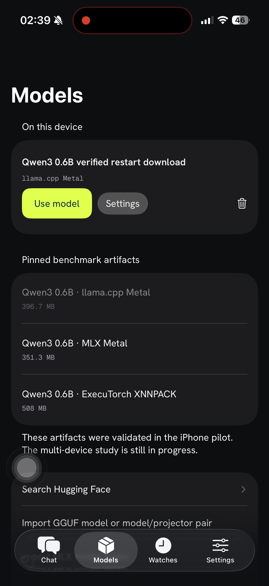
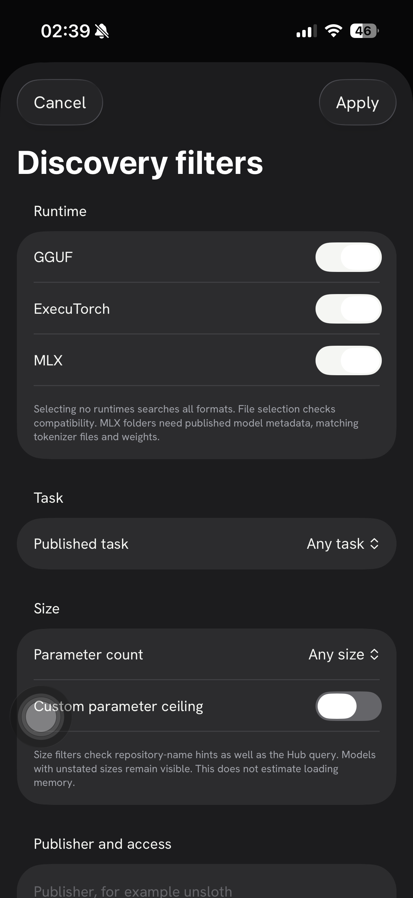
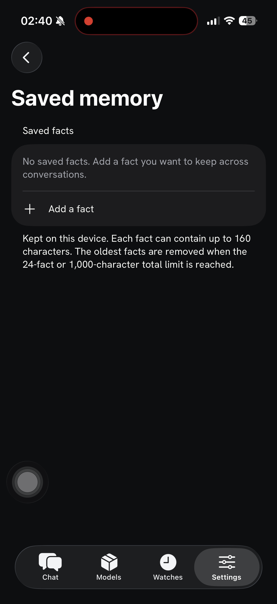
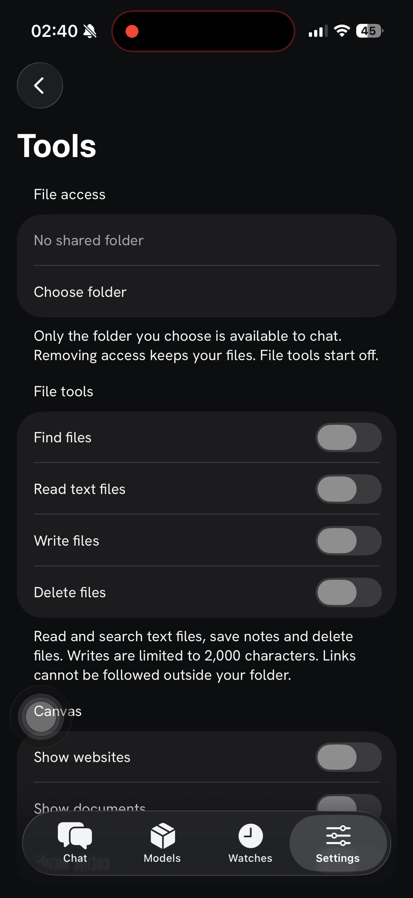
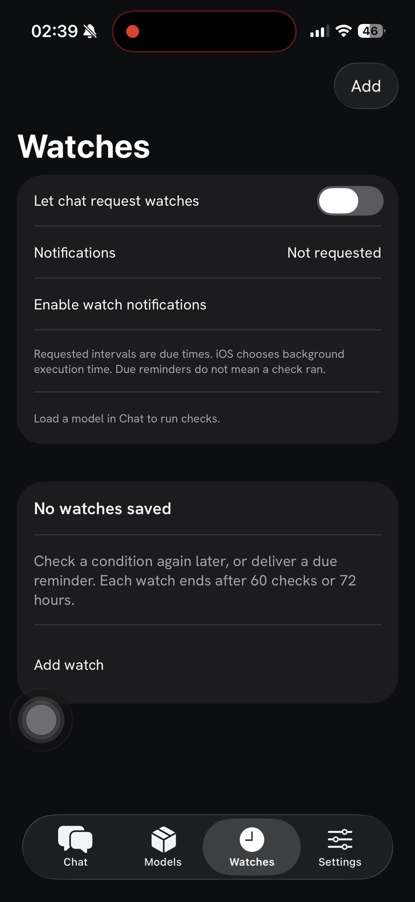
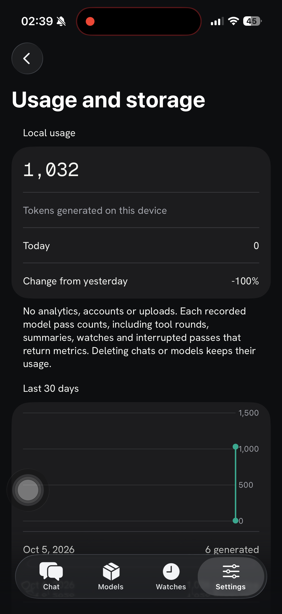

# OpenWeights iOS

OpenWeights iOS is an experimental native iPhone app for running open-weight
language models on your device. Download or import a compatible model, chat
with it locally, and control which tools and saved facts it can use.

This is the iOS counterpart to
[OpenWeights for Android](https://github.com/ExperimentalMachines/openweights),
built by Experimental Machines with SwiftUI and a shared C++ inference core.
The repository also includes a separate benchmark harness for measuring how
models and inference runtimes behave on real iPhones.

## Screenshots

<table>
  <tr>
    <th>Model library</th>
    <th>Discovery filters</th>
    <th>Saved memory</th>
  </tr>
  <tr>
    <td></td>
    <td></td>
    <td></td>
  </tr>
  <tr>
    <th>File tools</th>
    <th>Watches</th>
    <th>Local usage</th>
  </tr>
  <tr>
    <td></td>
    <td></td>
    <td></td>
  </tr>
</table>

Captured on iPhone 16 during the October 7, 2026 native UI validation in the
separate benchmark-slot app container. These are development-build screenshots.
The original image hashes were checked against the retained local validation
record before adding these screenshots.

## What the app does

- **Find and manage models.** Search Hugging Face by runtime, task, publisher
  and size, download compatible artifacts, or import a local GGUF file.
- **Chat locally.** Stream responses, stop generation, manage saved
  conversations and adjust settings per model.
- **Control tools and memory.** Choose a shared folder, enable individual file
  operations and manage facts saved across conversations. File and memory
  tools start off and use approval controls when enabled.
- **Track local usage.** View generated token counts and model storage on
  the device.
- **Experiment with agent workflows.** Planning, questions, bounded goals,
  conversation folding and scheduled watches are under development. Their
  remaining acceptance checks are tracked in the
  [Android parity ledger](ios/Product/parity.md).

Model inference runs on the device. Model discovery and downloads use network
services, and enabled web tools can make network requests. Watch intervals are
due times: iOS controls when background work actually runs.

## Inference runtimes and benchmarks

| Runtime | Product integration | Benchmark coverage |
| --- | --- | --- |
| llama.cpp | Compatible GGUF models on CPU or Metal | CPU, full Metal and partial Metal configurations |
| MLX | Compatible MLX model folders on Metal | Standalone MLX |
| ExecuTorch | Validated Qwen3 XNNPACK export | XNNPACK, Core ML and MLX delegate exports |

Compatibility depends on the model architecture, artifact format and device
resources. A model appearing in search does not establish that it can run.
The benchmark harness measures first-response delay, streaming speed, process
memory, factual recall and interruption recovery with pinned artifacts and
retained source/build evidence.

The bounded CPU/Metal benchmark completed 36 conversations and 216 requests
on iPhone 16 across the Qwen3 pilot and five-model comparison. The
[published benchmark](https://experimentalmachines.github.io/OpenWeights-iOS/)
includes results, limitations and downloadable reproduction data. See the
[benchmark page guide](site/README.md) for the retained files and verification.
The broader multi-device study and full Android parity are parked with
evidence preserved. Selected passing checks do not establish full parity or
a general runtime winner.

## Build and test

Native builds require macOS, Xcode and the dependencies described in the
component guides. Current independent signed builds were verified with
Xcode 26.2. Model weights and prebuilt ExecuTorch dependencies are acquired
separately.

From the repository root, prepare and verify the pinned native dependencies:

```sh
python3 prepare-native-dependencies.py
python3 prepare-native-dependencies.py --check
```

Run the host Swift core tests:

```sh
swift test --package-path ios/Product
```

Follow [the product build guide](ios/Product/README.md) for the SwiftUI app,
or [the benchmark build guide](ios/Benchmark/README.md) for the measurement
harness. The product build requires native libraries prepared with the same
selected Xcode toolchain.

## Repository layout

| Path | Purpose |
| --- | --- |
| `ios/Product` | SwiftUI app, shared Swift core and product tests |
| `ios/Benchmark` | Benchmark app, model export helpers, protocols and analysis |
| `core/engine` | Shared C++ session adapter and pinned llama.cpp dependency |
| `core/sandbox` | Pinned QuickJS dependency for script tools |
| `docs/research` | Measured reports and comparison figures |
| `migration` | Source provenance, validation receipts and artifact storage records |

Generated builds, model files and full test bundles are excluded from Git.
Large completed artifacts are archived privately on Hugging Face. See the
[storage layout](migration/storage-layout.md) for retained paths and restoration.

## Migration and verification details

<details>
<summary>Independent checkout validation and retained study evidence</summary>

This checkout separates the iOS sources from the Android repository. Sources
and native dependency hashes are verified. Independent signed product compilation
and six selected real-iPhone migration checks pass with Xcode 26.2. The independent
baseline benchmark passes three native methods and 45 requests across five
configurations. The rebuilt Core ML and ExecuTorch MLX targets pass three native
methods and 18 requests, including cancellation and recovery. These selected checks
validate execution from this checkout, not full study replication or parity.
Working reports and model exports use shared workspace
storage with links preserving historical paths. Historical signed builds remain
in the original checkout.
The full multi-device study and Android feature parity remain incomplete.
The [source manifest](migration/source-manifest.json) retains provenance and
copied-file checksums.

Historical proof files retain their original paths and hashes.

</details>
