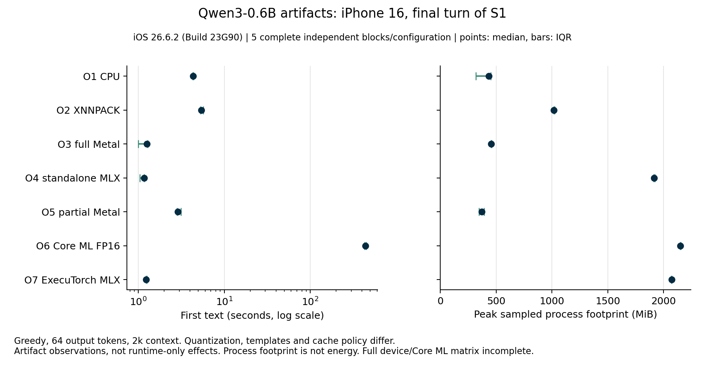

# OpenWeights iOS repeated artifact study

Status: publication draft, matrix incomplete. 1 local artifact configuration has five complete independent blocks in each of three scenarios. Core ML and cloud replication remain incomplete. Initial GGUF routing is recorded in ADR-0004. Final cross-format recommendations remain open. Strict source/build matching satisfies 9 of 63 planned cells. The historical 19-cell count pooled builds and is superseded.

## Methods

The protocol compares pinned Qwen3-0.6B artifacts in three six-turn synthetic conversations. S1 retains original facts, S2 replaces stale facts, and S3 cancels an auxiliary generation before turn 4, resets the adapter and reconstructs the recorded conversation. Each device/OS/artifact/scenario cell requires five independent report blocks. Greedy decoding, thinking off, 64 output tokens and a 2,048-token ceiling are fixed. Fast runtime order rotates by block. Core ML runs separately.

Primary requests use each adapter's documented cache policy. Prefix-enabled adapters also replay the identical recorded messages after resetting the conversation. Adapter-load timing is separate from request timing. Filesystem caches are not controlled. Process footprint is sampled, not total system memory or energy.

Different quantization, exports, templates and cache policies make comparisons between formats artifact comparisons. CPU, full Metal and partial Metal share the same GGUF and native prompt/decoder implementation, permitting a controlled offload comparison. The delegate target also links different dependencies, so whole-process footprint is not isolated backend memory. OS and lab conditions differ between devices. Synthetic recall does not establish general conversational quality.

## Final-turn observations

First text is the measured first callback. Values are medians and interquartile ranges between independent complete reports. Partial reports remain in the analysis, including complete adapter rows in globally incomplete reports. The tables use complete-report sensitivity metrics. A row with one completed block is descriptive and does not satisfy the replication target.

Exact expected values and requested output structure are graded independently. The factual score requires every requested value, including its spelling. It does not measure semantic equivalence or give partial credit. A correct fenced JSON object passes facts and fails plain-JSON format. A structurally valid object with a wrong value can pass format and fail facts. The original combined harness check remains available as strictProbeSuccess.

### Stable facts

| Device and actual OS | Config | Build cohort | Complete blocks | First text ms, median [p25, p75] | Decode tokens/s | Peak process MiB | Facts | Format |
|---|---|---|---:|---:|---:|---:|---:|---:|
| iPhone17,1, Version 18.3.1 (Build 22D72) | O1 llama.cpp CPU | 3bb607d181de | 1 | 3081.6 [3081.6, 3081.6] | 30.24 | 402.2 | 1/1 | 1/1 |
| iPhone17,1, Version 18.3.1 (Build 22D72) | O2 ExecuTorch XNNPACK | 3bb607d181de | 1 | 4576.2 [4576.2, 4576.2] | 32.39 | 1362.9 | 1/1 | 1/1 |
| iPhone17,1, Version 18.3.1 (Build 22D72) | O3 llama.cpp Metal | 3bb607d181de | 1 | 663.0 [663.0, 663.0] | 79.30 | 322.9 | 1/1 | 1/1 |
| iPhone17,1, Version 18.3.1 (Build 22D72) | O4 MLX Metal | 3bb607d181de | 1 | 700.2 [700.2, 700.2] | 97.08 | 2200.6 | 1/1 | 0/1 |
| iPhone17,1, Version 18.3.1 (Build 22D72) | O5 llama.cpp partial Metal | 3bb607d181de | 1 | 2043.7 [2043.7, 2043.7] | 40.16 | 376.7 | 1/1 | 1/1 |
| iPhone17,1, Version 18.3.2 (Build 22D82) | O6 ExecuTorch Core ML | 60ed45678b6a | 4 | 496968.2 [491726.5, 503184.1] | 3.01 | 2506.6 | 4/4 | 4/4 |
| iPhone17,3, Version 26.6.2 (Build 23G90) | O1 llama.cpp CPU | 5e30ac6d2858 | 5 | 4339.8 [4309.1, 4381.2] | 26.32 | 433.9 | 5/5 | 5/5 |
| iPhone17,3, Version 26.6.2 (Build 23G90) | O2 ExecuTorch XNNPACK | 5e30ac6d2858 | 5 | 5412.9 [5305.7, 5677.1] | 20.35 | 1017.4 | 5/5 | 5/5 |
| iPhone17,3, Version 26.6.2 (Build 23G90) | O3 llama.cpp Metal | 5e30ac6d2858 | 5 | 1264.4 [1001.2, 1280.1] | 63.62 | 457.1 | 5/5 | 5/5 |
| iPhone17,3, Version 26.6.2 (Build 23G90) | O4 MLX Metal | 5e30ac6d2858 | 5 | 1164.7 [1041.9, 1168.9] | 85.95 | 1915.0 | 5/5 | 0/5 |
| iPhone17,3, Version 26.6.2 (Build 23G90) | O5 llama.cpp partial Metal | 5e30ac6d2858 | 5 | 2890.1 [2828.7, 3152.0] | 28.82 | 371.1 | 5/5 | 5/5 |
| iPhone17,3, Version 26.6.2 (Build 23G90) | O6 ExecuTorch Core ML | 60ed45678b6a | 5 | 440202.7 [430865.9, 447555.5] | 3.39 | 2151.0 | 5/5 | 5/5 |
| iPhone17,3, Version 26.6.2 (Build 23G90) | O7 ExecuTorch MLX | eeb7f69e96c8 | 5 | 1229.7 [1227.9, 1257.1] | 68.10 | 2072.5 | 5/5 | 5/5 |

### Updated facts

| Device and actual OS | Config | Build cohort | Complete blocks | First text ms, median [p25, p75] | Decode tokens/s | Peak process MiB | Facts | Format |
|---|---|---|---:|---:|---:|---:|---:|---:|
| iPhone17,3, Version 26.6.2 (Build 23G90) | O1 llama.cpp CPU | 3bb607d181de | 4 | 3703.8 [3626.1, 3758.1] | 29.28 | 436.8 | 4/4 | 4/4 |
| iPhone17,3, Version 26.6.2 (Build 23G90) | O1 llama.cpp CPU | 5e30ac6d2858 | 1 | 3207.4 [3207.4, 3207.4] | 30.33 | 334.3 | 1/1 | 1/1 |
| iPhone17,3, Version 26.6.2 (Build 23G90) | O2 ExecuTorch XNNPACK | 3bb607d181de | 4 | 5174.6 [4878.3, 5521.5] | 39.97 | 1018.6 | 4/4 | 4/4 |
| iPhone17,3, Version 26.6.2 (Build 23G90) | O2 ExecuTorch XNNPACK | 5e30ac6d2858 | 1 | 5712.6 [5712.6, 5712.6] | 28.61 | 1012.6 | 1/1 | 1/1 |
| iPhone17,3, Version 26.6.2 (Build 23G90) | O3 llama.cpp Metal | 3bb607d181de | 4 | 772.5 [753.1, 797.4] | 77.49 | 460.0 | 4/4 | 4/4 |
| iPhone17,3, Version 26.6.2 (Build 23G90) | O3 llama.cpp Metal | 5e30ac6d2858 | 1 | 869.8 [869.8, 869.8] | 77.25 | 453.5 | 1/1 | 1/1 |
| iPhone17,3, Version 26.6.2 (Build 23G90) | O4 MLX Metal | 3bb607d181de | 4 | 731.2 [712.3, 758.8] | 92.59 | 1810.7 | 4/4 | 0/4 |
| iPhone17,3, Version 26.6.2 (Build 23G90) | O4 MLX Metal | 5e30ac6d2858 | 1 | 913.8 [913.8, 913.8] | 91.57 | 1806.0 | 1/1 | 0/1 |
| iPhone17,3, Version 26.6.2 (Build 23G90) | O5 llama.cpp partial Metal | 3bb607d181de | 4 | 2074.1 [1988.3, 2098.6] | 35.19 | 382.0 | 4/4 | 4/4 |
| iPhone17,3, Version 26.6.2 (Build 23G90) | O5 llama.cpp partial Metal | 5e30ac6d2858 | 1 | 1819.2 [1819.2, 1819.2] | 35.14 | 392.0 | 1/1 | 1/1 |
| iPhone17,3, Version 26.6.2 (Build 23G90) | O6 ExecuTorch Core ML | b5e71b31a645 | 2 | 447900.7 [445863.9, 449937.4] | 3.43 | 2144.6 | 2/2 | 0/2 |
| iPhone17,3, Version 26.6.2 (Build 23G90) | O7 ExecuTorch MLX | eeb7f69e96c8 | 5 | 1350.3 [1350.3, 1366.6] | 68.57 | 2063.1 | 5/5 | 5/5 |

### Interruption and recovery

| Device and actual OS | Config | Build cohort | Complete blocks | First text ms, median [p25, p75] | Decode tokens/s | Peak process MiB | Facts | Format |
|---|---|---|---:|---:|---:|---:|---:|---:|
| iPhone17,3, Version 26.6.2 (Build 23G90) | O1 llama.cpp CPU | 3bb607d181de | 4 | 3407.5 [3274.4, 3619.1] | 30.35 | 376.7 | 0/4 | 4/4 |
| iPhone17,3, Version 26.6.2 (Build 23G90) | O1 llama.cpp CPU | 5e30ac6d2858 | 1 | 3157.8 [3157.8, 3157.8] | 28.85 | 318.2 | 0/1 | 1/1 |
| iPhone17,3, Version 26.6.2 (Build 23G90) | O2 ExecuTorch XNNPACK | 3bb607d181de | 4 | 5184.8 [4849.4, 5500.0] | 39.62 | 1015.6 | 4/4 | 4/4 |
| iPhone17,3, Version 26.6.2 (Build 23G90) | O2 ExecuTorch XNNPACK | 5e30ac6d2858 | 1 | 5275.5 [5275.5, 5275.5] | 30.84 | 1016.0 | 1/1 | 1/1 |
| iPhone17,3, Version 26.6.2 (Build 23G90) | O3 llama.cpp Metal | 3bb607d181de | 4 | 820.7 [775.3, 870.1] | 77.59 | 454.5 | 0/4 | 4/4 |
| iPhone17,3, Version 26.6.2 (Build 23G90) | O3 llama.cpp Metal | 5e30ac6d2858 | 1 | 809.4 [809.4, 809.4] | 76.70 | 456.0 | 0/1 | 1/1 |
| iPhone17,3, Version 26.6.2 (Build 23G90) | O4 MLX Metal | 3bb607d181de | 4 | 813.7 [782.6, 825.2] | 93.39 | 1955.7 | 0/4 | 0/4 |
| iPhone17,3, Version 26.6.2 (Build 23G90) | O4 MLX Metal | 5e30ac6d2858 | 1 | 789.2 [789.2, 789.2] | 92.86 | 1970.1 | 0/1 | 0/1 |
| iPhone17,3, Version 26.6.2 (Build 23G90) | O5 llama.cpp partial Metal | 3bb607d181de | 4 | 1959.7 [1797.3, 2161.4] | 36.43 | 370.2 | 0/4 | 4/4 |
| iPhone17,3, Version 26.6.2 (Build 23G90) | O5 llama.cpp partial Metal | 5e30ac6d2858 | 1 | 2271.4 [2271.4, 2271.4] | 34.63 | 384.9 | 0/1 | 1/1 |
| iPhone17,3, Version 26.6.2 (Build 23G90) | O7 ExecuTorch MLX | eeb7f69e96c8 | 5 | 1321.0 [1305.4, 1321.1] | 69.76 | 2207.6 | 5/5 | 5/5 |

## Interpretation

F1. Replicated local S1 measurements show shorter final-turn first-text latency for full Metal and standalone MLX than CPU, partial Metal and XNNPACK. S2 baseline comparisons now split into one earlier and four foreground-guard blocks. They remain descriptive within each build cohort and do not satisfy five matching repetitions.

F2. The historical S3 baseline results combined one earlier build with four foreground-guard blocks. All five conversations remain retained, but neither build supplies five matching blocks. Exact spelling failures remain observations in their separate cohort rows. They do not establish cache corruption, a lost dietary preference or general model quality.

F3. Initial product GGUF routing uses full Metal when available, with an explicit CPU choice, based on the controlled local offload comparison. Core ML remains benchmark-only. The product has an experimental ExecuTorch MLX path whose scoped verification and retained failures are tracked in ios/Product/parity.md. Broader recommendations require the unfinished Core ML and device cells.

F4. The corrected 2k ExecuTorch MLX export now completes five independent local blocks in S1, S2 and S3. Every final turn passes exact facts and plain-JSON formatting in 5/5 blocks. Median final-turn first text is 1.23 to 1.35 seconds, decode throughput is 68.10 to 69.76 tokens/s, and sampled whole-process footprint is 2,063 to 2,208 MiB. This artifact rebuilds each turn. These results do not establish a universal runtime winner or energy efficiency.

F5. The static-step FP16 Core ML CPU/GPU artifact now has 5 complete matching local S1 blocks. Final-turn first text is 440.20 seconds, with an IQR of 430.87 to 447.56 seconds. All final JSON answers retain the requested facts and structure. Each block's earlier one-word dietary probe returns diet instead of vegan. This is replicated local S1 evidence, not completed S2/S3 or multi-device replication. The artifact rebuilds the prompt each turn. No Neural Engine, energy or runtime-only conclusion follows.

## Failures and incomplete cells

S2 block 1 was killed by iOS while non-frontmost. Partial checkpoints and explicit retries remain retained. The foreground guard cancelled later S2 and S3 attempts. Four complete foreground-guard primary blocks exist per baseline scenario, plus one earlier complete block. Different compiled source/executable fingerprints cannot supply a fifth matching repetition. The historical 19-cell tally is corrected to nine source/build-matched cells.

ExecuTorch MLX S1 block 0 first failed before launch while locked. Attempt 1 later cancelled on app inactivity after five recorded turns. Attempt 2 completed, remains a retry, and does not inflate primary replication. Independent S1 blocks 1 through 5 supply the five-block target. S2 and S3 each use independent blocks 0 through 4. The launch receipt, partial report, retry and all source snapshots are retained.

Two historical SE 3 study submissions, on catalog iOS 18.4 and the approved 26.3 replacement, each ended after three infrastructure attempts without an inference report. Later compatibility checks passed nine full-Metal smoke requests and then 45 current-build requests across five baseline configurations on actual iOS 18.4 (22E240). Those checks are separate from the repeated study. All SE study cells remain incomplete, and historical failures do not establish current device unavailability.

The first cloud Pro S1 block completed on actual iOS 18.3.1. The next reported iOS 18.3.2 and stopped after 30 requests because the phone did not cool to nominal within three minutes following MLX. MLX ended at fair temperature. These OS cohorts remain separate, and the partial block does not supply a full repetition. Cloud charging state and ambient temperature are unknown.

Local Core ML S1 meets the five-block target. Core ML S2/S3 and cloud replication remain incomplete. Cloud Core ML Pro S1 has 4/5 complete blocks on Version 18.3.2 (Build 22D82). Actual OS cohorts remain separate. Missing and unavailable cells are recorded in Study/execution-ledger-2026-10-03.json.

Cloud Core ML final-turn thermal sensitivity: only 1/4 final-turn samples on Version 18.3.2 (Build 22D82) have nominal thermal state at both request boundaries. Non-nominal measurements remain in the main results, with nominal-only metrics retained separately in the analysis JSON. These samples do not establish a temperature-controlled hardware comparison.

## Reproduction and provenance

Run Study/analyze_study.py with the raw paths below, --minimum-blocks 5 and an output JSON path. Run Study/report_study.py ANALYSIS_JSON --appendix Study/report-appendix-2026-10-04.md --output REPORT.md to regenerate this report including the retained acquisition records. Run Study/update_ledger.py ANALYSIS_JSON Study/execution-ledger-2026-10-03.json to refresh execution counts. These commands run from ios/Benchmark. The analyzer separates actual device/OS, artifact hashes, runtime versions, scenario, turn and cache policy. Complete-report and nominal-only sensitivity metrics are included in the JSON. Keep every paired source proof beside its raw report. Schema 5 groups load and turn distributions by buildCohortSHA256 as well as artifact and OS.

Protocol: Study/protocol-v1.json, grading version 3. Study/grading-v3.md records the post-baseline correction separating formatting from facts. The version-2 analyzer, pre-addendum protocol and earlier analyses are preserved. Factual expectations and raw outputs are unchanged.

Schema 5 binds every raw report to its retained source proof and separates exact source maps, executable maps and compile toolchains, alongside artifact, device/OS, protocol, context/output controls and cache policy. Missing or mismatched source proofs are refused. The foreground-guard source change is a distinct build cohort. No energy or Neural Engine placement was measured. Dated appendix counts are historical snapshots and do not override this corrected coverage.

Historical figures and their frozen analyses remain retained. The S2/S3 six-configuration figures pooled different source/build cohorts and do not prove five matching blocks. They are not used as current replication figures.

The local S1 seven-configuration figure remains a five-matching-build-block result within each configuration. Current source/build-separated table rows above supply the authoritative counts.

The additional S1 figure includes all seven configurations with five matching complete local blocks each. Its latency axis uses a log scale because the static-step Core ML artifact is much slower. The historical six-configuration figures above remain unchanged.

Regenerate from ios/Benchmark with .build/plot-tools/bin/python Study/plot_study.py Results/study-analysis-source-build-separated-schema5-grading3-2026-10-07.json --output-dir ../../docs/research/assets/ios-study-source-build-20261007 --scenarios S1-stable-facts --include-coreml --include-executorch-mlx. PNG, SVG, PDF and provenance hashes are retained.

Raw input files and SHA-256:

- `firebase-iphone16pro-study-S1-block0-2026-10-02.json`: `0a5f6f7f41a033b7fb539e86dfc7d5eaadd07b6bd3f7579e063410d31cf19047`, build `3bb607d181de3617357ea6e7ece2c8696a770f90b230b6741185a986a1f0d95a`, source proof `firebase-iphone16pro-study-S1-block0-source.json` (`e7d0abf4a304e77b1349786977973890f25c767aef8348b6db3db4960718a1be`)
- `firebase-iphone16pro-study-S1-block1-2026-10-02.json`: `1cafabcc148c982a3849854c7888eaa9e22a67329b4440323cb5fe61d58d0560`, build `3bb607d181de3617357ea6e7ece2c8696a770f90b230b6741185a986a1f0d95a`, source proof `firebase-iphone16pro-study-S1-block1-source.json` (`a6d6539e459ee291b8d2611e4c1a3601035a4ddc362dec3a10c28fd9352b0e63`)
- `iPhone17,3-study-S1-stable-facts-block0-attempt0-23393F8D-3BF9-4661-9BFC-4CF3BD666BAA.json`: `c02cae0484c2df034e978ac820b30e07757820ef9a42453826138d87c7537b2d`, build `5e30ac6d2858261dfeb245a0e0b133567e91d7312094a495ee4914b0174f2a80`, source proof `iPhone17,3-study-S1-stable-facts-block0-attempt0-23393F8D-3BF9-4661-9BFC-4CF3BD666BAA-source.json` (`e9a57c77bb4a684f588aca1ea81370c41de03b33ab3c3a766a2b2ae10145062c`)
- `iPhone17,3-study-S1-stable-facts-block0-attempt1-B85D844F-548C-4F50-A327-9E7D04034BED.json`: `e6e94e492683a494962ffc0297e2d6b03056de9a36941895090e681af69b10e1`, build `eeb7f69e96c8129f7cbd20688d5ef56c1f196f827d2d107851fa9e469a8a5336`, source proof `iPhone17,3-study-S1-stable-facts-block0-attempt1-B85D844F-548C-4F50-A327-9E7D04034BED-source.json` (`23fdf3fe1ce99287ec1dd12d53f7a01e64345901d9c2b81ab098c652fd006809`)
- `iPhone17,3-study-S1-stable-facts-block0-attempt2-A7F14333-40E0-4A9F-87AC-C799C1DA2D85.json`: `c74bbcb0f5654c6bc64ce3d9ca2536a0ede2c3860a2854f10f8cc19c3770d346`, build `eeb7f69e96c8129f7cbd20688d5ef56c1f196f827d2d107851fa9e469a8a5336`, source proof `iPhone17,3-study-S1-stable-facts-block0-attempt2-A7F14333-40E0-4A9F-87AC-C799C1DA2D85-source.json` (`1488ea3007d10ddf7de4bf8abfdad326dad389ce42ab96dbad3794bedb99f6fa`)
- `iPhone17,3-study-S1-stable-facts-block1-attempt0-65171B1F-9537-4696-933F-2630A031787A.json`: `d3deb0431770a2b90d4c264f6dfc24c64038a924905d1a123094a1f89752b55a`, build `5e30ac6d2858261dfeb245a0e0b133567e91d7312094a495ee4914b0174f2a80`, source proof `iPhone17,3-study-S1-stable-facts-block1-attempt0-65171B1F-9537-4696-933F-2630A031787A-source.json` (`1f24b327131f9a4d96cb208c540568ab1da7d0bb8584c65a8f722ced4cb064a2`)
- `iPhone17,3-study-S1-stable-facts-block1-attempt0-AF907B2C-425F-4FC1-9C1E-79479EBAEE12.json`: `d0adc662ea225aa1ce1e71dd5051450007497c9b1506d2589f9218ca23b35a09`, build `eeb7f69e96c8129f7cbd20688d5ef56c1f196f827d2d107851fa9e469a8a5336`, source proof `iPhone17,3-study-S1-stable-facts-block1-attempt0-AF907B2C-425F-4FC1-9C1E-79479EBAEE12-source.json` (`167490e595e2487f43fe20d17bb464ca29cd1dde715ed7c3937094f071602c26`)
- `iPhone17,3-study-S1-stable-facts-block2-attempt0-6AFE8E7F-D948-41BE-9CFC-9C4489694088.json`: `36da8627a0d48c334609715fef375b1f11741a0e60b3762feaeec97955ead2e1`, build `5e30ac6d2858261dfeb245a0e0b133567e91d7312094a495ee4914b0174f2a80`, source proof `iPhone17,3-study-S1-stable-facts-block2-attempt0-6AFE8E7F-D948-41BE-9CFC-9C4489694088-source.json` (`867224236ae87e49291fe8f5426b3765b916d0bc34ffa71f42123d814f7fde3d`)
- `iPhone17,3-study-S1-stable-facts-block2-attempt0-E4B873E1-44FA-4028-B4B5-D3CA068E5576.json`: `b28c4619e267ad73adc2c0060ebb7edb5bea8ea5ae0ffef36de85b0b22d29386`, build `eeb7f69e96c8129f7cbd20688d5ef56c1f196f827d2d107851fa9e469a8a5336`, source proof `iPhone17,3-study-S1-stable-facts-block2-attempt0-E4B873E1-44FA-4028-B4B5-D3CA068E5576-source.json` (`efe354a9a6c744b11054591e481a9c9bfde448019c30ed3fd2f039acd54bbcb3`)
- `iPhone17,3-study-S1-stable-facts-block3-attempt0-05063A52-BF85-4B15-95B3-4E565DD4F4B9.json`: `704d2cfa09ed6619a5f0b03fe14bbb3e49ae07fd57fae41938eb7e8090b4bcad`, build `eeb7f69e96c8129f7cbd20688d5ef56c1f196f827d2d107851fa9e469a8a5336`, source proof `iPhone17,3-study-S1-stable-facts-block3-attempt0-05063A52-BF85-4B15-95B3-4E565DD4F4B9-source.json` (`0bc3d66af933daa183eb04af5d3b116ad329cb8efc9b5720722729a09d1a6f21`)
- `iPhone17,3-study-S1-stable-facts-block3-attempt0-B8144ECB-EEA9-4E45-9C06-24517FE55687.json`: `b1993a203a9650398abb99d95b7c8aaac693ba99b120803357a7ca91bd7e8d06`, build `5e30ac6d2858261dfeb245a0e0b133567e91d7312094a495ee4914b0174f2a80`, source proof `iPhone17,3-study-S1-stable-facts-block3-attempt0-B8144ECB-EEA9-4E45-9C06-24517FE55687-source.json` (`23980d063a80f88a372b51795e72576e2ac43ebd8acb51b1c36345ff48adcc27`)
- `iPhone17,3-study-S1-stable-facts-block4-attempt0-1E6E871D-41BE-45B5-A7D2-BD03D906340A.json`: `b4d1ad47e2811e90e79699e1c6abab3f1815c668b639d4422ef6cca6d1e8a9f3`, build `eeb7f69e96c8129f7cbd20688d5ef56c1f196f827d2d107851fa9e469a8a5336`, source proof `iPhone17,3-study-S1-stable-facts-block4-attempt0-1E6E871D-41BE-45B5-A7D2-BD03D906340A-source.json` (`639b424605859d1bc4251b9b1babcf5a353398073b336b2bfd76d4499cef5bbb`)
- `iPhone17,3-study-S1-stable-facts-block4-attempt0-DFF38525-E2CD-4E9A-90AD-5D6B1BD2B3CF.json`: `f853b8b7b7a26511206d79a30e468b44315136dcfb81af8d5078f9909881b903`, build `5e30ac6d2858261dfeb245a0e0b133567e91d7312094a495ee4914b0174f2a80`, source proof `iPhone17,3-study-S1-stable-facts-block4-attempt0-DFF38525-E2CD-4E9A-90AD-5D6B1BD2B3CF-source.json` (`e9b9ba09e4db50a3c021a3fa37b7c92d98e29f1839850b32ffb565df3cac9e88`)
- `iPhone17,3-study-S1-stable-facts-block5-attempt0-A13C0A65-CC12-4ED7-A168-C002ACBE3432.json`: `7c84f32f312ba5718b146decf6ef5a1008ef323a0811d803f757f84831aa1fcb`, build `eeb7f69e96c8129f7cbd20688d5ef56c1f196f827d2d107851fa9e469a8a5336`, source proof `iPhone17,3-study-S1-stable-facts-block5-attempt0-A13C0A65-CC12-4ED7-A168-C002ACBE3432-source.json` (`8ae79ae30c88fe356ef2acf22e53906d254ea7614e50c9f844de699e42517aa9`)
- `iPhone17,3-study-S2-workshop-corrections-block0-attempt0-28705138-1426-4292-ABE1-A83E58D5C5B5.json`: `674f475f6c5bba2aa3b15fc9ff9051d0f1a4930b80fb0f9941d09635886bdec7`, build `eeb7f69e96c8129f7cbd20688d5ef56c1f196f827d2d107851fa9e469a8a5336`, source proof `iPhone17,3-study-S2-workshop-corrections-block0-attempt0-28705138-1426-4292-ABE1-A83E58D5C5B5-source.json` (`b2e2f6bcd36628da038dea4af2e268036829d82bc61d3e3b42a8ccdd674f574f`)
- `iPhone17,3-study-S2-workshop-corrections-block0-attempt0-4FDFD0E0-3E1E-4348-A043-3937AB2B4568.json`: `a744be64842c5909d2999a4b35c4574789b652793b5e07dc687fef20476beb2f`, build `5e30ac6d2858261dfeb245a0e0b133567e91d7312094a495ee4914b0174f2a80`, source proof `iPhone17,3-study-S2-workshop-corrections-block0-attempt0-4FDFD0E0-3E1E-4348-A043-3937AB2B4568-source.json` (`99144b8d6df11e34ece77f4b922c98b7b9524ce536882fe3a3a8f3b6ddec1d2d`)
- `iPhone17,3-study-S2-workshop-corrections-block1-attempt0-3A247D7B-F63E-4CBE-AB29-27BF1D9B1E6D.json`: `97b0027fc26e5d813d2bf257fe838b9bddfc645c2ec61980450d73027bbfdc54`, build `eeb7f69e96c8129f7cbd20688d5ef56c1f196f827d2d107851fa9e469a8a5336`, source proof `iPhone17,3-study-S2-workshop-corrections-block1-attempt0-3A247D7B-F63E-4CBE-AB29-27BF1D9B1E6D-source.json` (`41b613e7dde13d5b8acb4dc54dd39e5f84b198ea7a187cada25a9398743e59f1`)
- `iPhone17,3-study-S2-workshop-corrections-block1-attempt0-AD099C32-57D7-4F33-92FE-3E1126840F5A.json`: `1cc93517b31296de61263b4400885b78f0d7bb9213ccad47245cf42205de4f1d`, build `5e30ac6d2858261dfeb245a0e0b133567e91d7312094a495ee4914b0174f2a80`, source proof `iPhone17,3-study-S2-workshop-corrections-block1-attempt0-AD099C32-57D7-4F33-92FE-3E1126840F5A-source.json` (`79964bb4cab4ca0b613e41e2835740419349dd8dd13e079839db464526fb0e7c`)
- `iPhone17,3-study-S2-workshop-corrections-block1-attempt1-1E6C480A-16E1-4124-8543-76385B2636BB.json`: `43559b0559cd61581b2cb88a51a197d8e83d7b198543f2e579ca8abac9d11694`, build `3bb607d181de3617357ea6e7ece2c8696a770f90b230b6741185a986a1f0d95a`, source proof `iPhone17,3-study-S2-workshop-corrections-block1-attempt1-1E6C480A-16E1-4124-8543-76385B2636BB-source.json` (`37279aa82bb5ba929e4d50b8b0aaee6976bfb960e730590992eec8bf2da6e6b9`)
- `iPhone17,3-study-S2-workshop-corrections-block2-attempt0-60FEC251-9772-446B-9F07-C210508DAD49.json`: `c549860771d410b003b9f1e77a46058eae8e117779f3063b9273be6392f33caf`, build `eeb7f69e96c8129f7cbd20688d5ef56c1f196f827d2d107851fa9e469a8a5336`, source proof `iPhone17,3-study-S2-workshop-corrections-block2-attempt0-60FEC251-9772-446B-9F07-C210508DAD49-source.json` (`7e12065bfbb7ef9869a46cf6da1baeb8ded200e5bf6ff74d1272016e965f8280`)
- `iPhone17,3-study-S2-workshop-corrections-block2-attempt0-F1E9068C-C2FB-4311-AF17-82D2E7D3830C.json`: `a849b820b96f652e22743986b96e18c1b765fd6a9f04a33e8b6094200ca83ed9`, build `3bb607d181de3617357ea6e7ece2c8696a770f90b230b6741185a986a1f0d95a`, source proof `iPhone17,3-study-S2-workshop-corrections-block2-attempt0-F1E9068C-C2FB-4311-AF17-82D2E7D3830C-source.json` (`5be99877e9c7e0e9aaae679ee165ade25d955230b68884d518147d4f571ca5e3`)
- `iPhone17,3-study-S2-workshop-corrections-block3-attempt0-4956E41F-C4D1-471F-9CA6-2FCC7D2CC175.json`: `0a5143f2adeb4a6bfee51749556ad1306bd40e0fab160fb7d8a97a0534ddb56e`, build `3bb607d181de3617357ea6e7ece2c8696a770f90b230b6741185a986a1f0d95a`, source proof `iPhone17,3-study-S2-workshop-corrections-block3-attempt0-4956E41F-C4D1-471F-9CA6-2FCC7D2CC175-source.json` (`91183c509fd905031af05774226edfd28a3219cc894e4965f2bbb5e28fb3bf8c`)
- `iPhone17,3-study-S2-workshop-corrections-block3-attempt0-E61886BA-4EA6-4F9A-942C-3855FCA59A35.json`: `51ece61cfd38e9d87fe3e2116e179a0603eeb9e846d331cbd1769c764179fad0`, build `eeb7f69e96c8129f7cbd20688d5ef56c1f196f827d2d107851fa9e469a8a5336`, source proof `iPhone17,3-study-S2-workshop-corrections-block3-attempt0-E61886BA-4EA6-4F9A-942C-3855FCA59A35-source.json` (`4b227a6b1874c05d714fceee50b344998581387ed3271e449a859ab147016f27`)
- `iPhone17,3-study-S2-workshop-corrections-block4-attempt0-06853FAA-E68F-4B19-89F6-F93D2A592148.json`: `a74c40043d7fbdb3afec3d0eb58de0b85753c44a1fc9b895a0acc9af969ec087`, build `3bb607d181de3617357ea6e7ece2c8696a770f90b230b6741185a986a1f0d95a`, source proof `iPhone17,3-study-S2-workshop-corrections-block4-attempt0-06853FAA-E68F-4B19-89F6-F93D2A592148-source.json` (`4170a85913582fd1a73f54c53d48841c536076bd92439c9c99c1c2ebce9b4ef7`)
- `iPhone17,3-study-S2-workshop-corrections-block4-attempt0-48159A7B-2241-48D5-9BEE-6FC77B9E57B3.json`: `45dd5b1abb2bf9474438504f187c403ac3a6c7bb7d30b50574cdea3bf19971e8`, build `eeb7f69e96c8129f7cbd20688d5ef56c1f196f827d2d107851fa9e469a8a5336`, source proof `iPhone17,3-study-S2-workshop-corrections-block4-attempt0-48159A7B-2241-48D5-9BEE-6FC77B9E57B3-source.json` (`ce10f4f4693cc27193bc011d158443bffc97e1a0197c55ce8b1a18af6d5c1310`)
- `iPhone17,3-study-S2-workshop-corrections-block5-attempt0-05FEFD60-5228-4172-B1DD-57A230A4AE1C.json`: `5339a2f2ee24e17a223bdaa4f283d5117f9d258059000721879813933d1b145d`, build `3bb607d181de3617357ea6e7ece2c8696a770f90b230b6741185a986a1f0d95a`, source proof `iPhone17,3-study-S2-workshop-corrections-block5-attempt0-05FEFD60-5228-4172-B1DD-57A230A4AE1C-source.json` (`6a0bd32651a709592994f2dfa110b6ff4b2979a0874686ada79ccbc9462344b1`)
- `iPhone17,3-study-S2-workshop-corrections-block6-attempt0-73EED75C-9890-431E-B521-7F6DAAF765F5.json`: `02e2fd0102bd9213fed020f9d7cd201fd11450c503e62f8a845abd54e6e43ca1`, build `3bb607d181de3617357ea6e7ece2c8696a770f90b230b6741185a986a1f0d95a`, source proof `iPhone17,3-study-S2-workshop-corrections-block6-attempt0-73EED75C-9890-431E-B521-7F6DAAF765F5-source.json` (`de476df20c084591731650c24d980298b436e5cc1a455cabff76b181b65889b8`)
- `iPhone17,3-study-S2-workshop-corrections-block7-attempt0-C0C83DCA-88F3-45C0-8880-4B7B7C8079FA.json`: `45e12bb1204b993110c8ff99c49d18133ea8cd8f11b3de55787a8d47e9a57096`, build `3bb607d181de3617357ea6e7ece2c8696a770f90b230b6741185a986a1f0d95a`, source proof `iPhone17,3-study-S2-workshop-corrections-block7-attempt0-C0C83DCA-88F3-45C0-8880-4B7B7C8079FA-source.json` (`6fb47ea536c1f2ca24ef3698c5af664971e368f6e7f3921a75cccf92cee9aa2e`)
- `iPhone17,3-study-S3-interruption-recovery-block0-attempt0-6EAD9A09-2C69-43FD-B96E-C57B9CB7695F.json`: `a86a897d067e4837ab3b292cce22ec79df2bcb55f844d8bf39b5a975d686cca6`, build `eeb7f69e96c8129f7cbd20688d5ef56c1f196f827d2d107851fa9e469a8a5336`, source proof `iPhone17,3-study-S3-interruption-recovery-block0-attempt0-6EAD9A09-2C69-43FD-B96E-C57B9CB7695F-source.json` (`2e2bc1e2b82319a4e1701275b1cae83c329a151beee3cc7b849e46606d4c81cc`)
- `iPhone17,3-study-S3-interruption-recovery-block1-attempt0-D4C6D5DD-E25F-458F-BFBA-0B024E5BA9A0.json`: `88a949238977ec35f16badc15dd2540cd5d449e3c25046bb93ff8b2e95c99c36`, build `3bb607d181de3617357ea6e7ece2c8696a770f90b230b6741185a986a1f0d95a`, source proof `iPhone17,3-study-S3-interruption-recovery-block1-attempt0-D4C6D5DD-E25F-458F-BFBA-0B024E5BA9A0-source.json` (`fc17ec329153a33a5acd974c0eaa8d250b925482cab85411710d20bfa2ef6e78`)
- `iPhone17,3-study-S3-interruption-recovery-block1-attempt0-E79879FE-2F33-4257-82ED-EFA4DD20023B.json`: `c15120d7c0be1d512450609e2b82a5d4e41bf6c4fc78c626e3101c2be7ca0272`, build `eeb7f69e96c8129f7cbd20688d5ef56c1f196f827d2d107851fa9e469a8a5336`, source proof `iPhone17,3-study-S3-interruption-recovery-block1-attempt0-E79879FE-2F33-4257-82ED-EFA4DD20023B-source.json` (`f4f69eb20777f6634154f2650fc5cd8004efb28eb6b8cd9746f4ec7115ce87b0`)
- `iPhone17,3-study-S3-interruption-recovery-block2-attempt0-C65FB68A-8E0C-4517-A021-EB42B5E4D31B.json`: `b91557418ef15c01c83572c031400730f432af8a2ac8e4ed88e1fd97a9bd004f`, build `3bb607d181de3617357ea6e7ece2c8696a770f90b230b6741185a986a1f0d95a`, source proof `iPhone17,3-study-S3-interruption-recovery-block2-attempt0-C65FB68A-8E0C-4517-A021-EB42B5E4D31B-source.json` (`5bc72066345723cd9a232c9e348749a7002c395d4b8d58d37acdea81e1565c06`)
- `iPhone17,3-study-S3-interruption-recovery-block2-attempt0-CDA98964-4948-4EFE-B6F8-116F8AC514FC.json`: `34773c34a75daffc41531f124da4f21362ab87951c8de575c398b10928a287fa`, build `eeb7f69e96c8129f7cbd20688d5ef56c1f196f827d2d107851fa9e469a8a5336`, source proof `iPhone17,3-study-S3-interruption-recovery-block2-attempt0-CDA98964-4948-4EFE-B6F8-116F8AC514FC-source.json` (`19a4a51170d71dd0367ec5f05027f3bd0ff1e617280dc5a0a47101a75948c898`)
- `iPhone17,3-study-S3-interruption-recovery-block3-attempt0-1D120424-8190-46BF-8402-E0B5D3D056AA.json`: `7a1360fe5e11e9ee0e82db9f544f12e5737cba00ac04204ac0de3ea9300dc1e4`, build `eeb7f69e96c8129f7cbd20688d5ef56c1f196f827d2d107851fa9e469a8a5336`, source proof `iPhone17,3-study-S3-interruption-recovery-block3-attempt0-1D120424-8190-46BF-8402-E0B5D3D056AA-source.json` (`50f1a50bab71314ab629e53c71c7bedb51b7cb267293ce71435be1c64d3ee749`)
- `iPhone17,3-study-S3-interruption-recovery-block3-attempt0-90D4FC1B-B6A1-4338-95A4-DD13A52B241C.json`: `7191a8d259bdfdda1474232e1aea56406789cfb599789826d3dfd3ec6d2aea66`, build `3bb607d181de3617357ea6e7ece2c8696a770f90b230b6741185a986a1f0d95a`, source proof `iPhone17,3-study-S3-interruption-recovery-block3-attempt0-90D4FC1B-B6A1-4338-95A4-DD13A52B241C-source.json` (`d32709401dc437e8b1b03247272d57f1db79ffaa3e118b176f4160d66a076893`)
- `iPhone17,3-study-S3-interruption-recovery-block4-attempt0-4764A208-8A69-4C96-A269-7F31992CF209.json`: `29f74a9ab655ceadb875ca40f1eec0425f460e2eb3cd64cb0126f44edf40cdf6`, build `eeb7f69e96c8129f7cbd20688d5ef56c1f196f827d2d107851fa9e469a8a5336`, source proof `iPhone17,3-study-S3-interruption-recovery-block4-attempt0-4764A208-8A69-4C96-A269-7F31992CF209-source.json` (`702488cfdfbd50ed1a530719f25511ce7c8dcea7a9d043c6ca0bdb3854d4feba`)
- `iPhone17,3-study-S3-interruption-recovery-block4-attempt0-BD1C4111-96FA-4FF9-8E8E-117A3F0420E8.json`: `108111e8bded99096fc63f3ee4ffb03068d27abee80ca8b058d2418be94fe992`, build `3bb607d181de3617357ea6e7ece2c8696a770f90b230b6741185a986a1f0d95a`, source proof `iPhone17,3-study-S3-interruption-recovery-block4-attempt0-BD1C4111-96FA-4FF9-8E8E-117A3F0420E8-source.json` (`ce24e7d2f20c0923526ce82feed28836cdcf7dd18b41686ca5cc0524b00c7130`)
- `iPhone17,3-study-S3-interruption-recovery-block5-attempt0-D38EBA7D-9D20-4A94-8A8A-64F27442B25E.json`: `b007f65608320dacc8006b2b4ac3db60fb524b1ef29cbe9127994a986112a203`, build `3bb607d181de3617357ea6e7ece2c8696a770f90b230b6741185a986a1f0d95a`, source proof `iPhone17,3-study-S3-interruption-recovery-block5-attempt0-D38EBA7D-9D20-4A94-8A8A-64F27442B25E-source.json` (`d4db3711e08c33496582f9133916e20df99bcd4b38d2376da0277f310b2c2d09`)
- `iphone16-study-S3-block0-2026-10-02.json`: `54cc59f39db156a8b221a9ce062ffb0c92ee728307c8359f474a4a92abfc9c85`, build `5e30ac6d2858261dfeb245a0e0b133567e91d7312094a495ee4914b0174f2a80`, source proof `iphone16-study-S3-block0-source.json` (`7f732df99d09008bee800101fb3b26c9f4b2e22a9c7be92f943406020cb742f7`)
- `iPhone17,3-study-S1-stable-facts-block0-attempt0-BFECCBE7-1F98-48F9-89EF-4B30EF3CBFF9.json`: `244924ec22e91181355fe389a383826439a97e148814f4e2f1f9f5e46c1451a0`, build `60ed45678b6ab518b46db1ba9a252eed7aa1c554082bab8b17dffbe44256ba38`, source proof `iPhone17,3-study-S1-stable-facts-block0-attempt0-BFECCBE7-1F98-48F9-89EF-4B30EF3CBFF9-source.json` (`2572512b5a3a13c20b622cbd6f79309e4a8ceb23ab1791ec4bce45210f77a5e0`)
- `iPhone17,3-study-S1-stable-facts-block1-attempt0-0EEF0F19-885C-4821-9291-70B7E1DF0247.json`: `c90b3224698aba088c1adf5073c92026856491ce36f46f2e080612c4a94a3521`, build `60ed45678b6ab518b46db1ba9a252eed7aa1c554082bab8b17dffbe44256ba38`, source proof `iPhone17,3-study-S1-stable-facts-block1-attempt0-0EEF0F19-885C-4821-9291-70B7E1DF0247-source.json` (`095908b69aa7c4997a185558601175b8a03cd58d4a93cad1a1dd8403f400caaa`)
- `iPhone17,3-study-S1-stable-facts-block2-attempt0-5BF7C23B-D836-4A9C-BE19-540E13E20124.json`: `8f504c7688aa07a6906464bc64270af36f0bbce34e1046cacb6f992701bfea42`, build `60ed45678b6ab518b46db1ba9a252eed7aa1c554082bab8b17dffbe44256ba38`, source proof `iPhone17,3-study-S1-stable-facts-block2-attempt0-5BF7C23B-D836-4A9C-BE19-540E13E20124-source.json` (`98c0e4afc7a934bb87366b8008e972d3f98e54b5f3b352560b099b0c30ccbfe5`)
- `iPhone17,3-study-S1-stable-facts-block3-attempt0-7794D995-C53F-47D9-B50D-4A25DA6EB6B2.json`: `ca841aa358d0ce6b36dc7e7fbda1d3e1f448541f355d197073d9c7885e2b6283`, build `60ed45678b6ab518b46db1ba9a252eed7aa1c554082bab8b17dffbe44256ba38`, source proof `iPhone17,3-study-S1-stable-facts-block3-attempt0-7794D995-C53F-47D9-B50D-4A25DA6EB6B2-source.json` (`67c40f0a9dc4a92b6c53ec7988368cb3f66ed048ed7b575584f7fc091a8112f8`)
- `iPhone17,1-study-S1-stable-facts-coreml-block0-attempt0-B662ED1B-0A69-42AA-88D5-FF81BA36A73C.json`: `187e705849ed388aeb9832025de216d0604d8783c52d9b2ae932a5708faee2c4`, build `60ed45678b6ab518b46db1ba9a252eed7aa1c554082bab8b17dffbe44256ba38`, source proof `iPhone17,1-study-S1-stable-facts-coreml-block0-attempt0-B662ED1B-0A69-42AA-88D5-FF81BA36A73C-source.json` (`6fc36ec0d8c2175337b286a19af3c0400d28b68d5976b3d52e5a748eddc32229`)
- `iPhone17,3-study-S1-stable-facts-block4-attempt0-6B62564D-63DE-45C9-BC3C-245EED0065DE.json`: `c05470e66d766b85af162df71509bc6133fb433df18fee470d5d798b926fd9c1`, build `60ed45678b6ab518b46db1ba9a252eed7aa1c554082bab8b17dffbe44256ba38`, source proof `iPhone17,3-study-S1-stable-facts-block4-attempt0-6B62564D-63DE-45C9-BC3C-245EED0065DE-source.json` (`c2eb21dc047a637254a0958d56fc5f944111b3e2e8bf482f0242039a58f9aa9a`)
- `iPhone17,3-study-S2-workshop-corrections-block0-attempt0-2FCB7C5E-FCE2-4377-A086-F84C58AED8DB.json`: `ab3128ac9c343c8706dd03f7248413dc49c7c700875c11c14493f8c25df5c8ca`, build `b5e71b31a645e32f073ae14a2c560478ea284e7362caadda97cc249430033953`, source proof `iPhone17,3-study-S2-workshop-corrections-block0-attempt0-2FCB7C5E-FCE2-4377-A086-F84C58AED8DB-source.json` (`e134d50203fcaa0a759d67dad570fd361bdc3b37d980a26aef16963fa490d2a7`)
- `iPhone17,3-study-S2-workshop-corrections-block1-attempt0-7EF08BAB-BE5F-488A-87C9-E14E53752C75.json`: `17a7560a93e97fb4ad5df4bf0a65fa4e133997c229da97a7980a1f1540a692da`, build `b5e71b31a645e32f073ae14a2c560478ea284e7362caadda97cc249430033953`, source proof `iPhone17,3-study-S2-workshop-corrections-block1-attempt0-7EF08BAB-BE5F-488A-87C9-E14E53752C75-source.json` (`7417d08553f4d1ba89e699c54c860266ac67d988d93760b2a01ae5cdcc14647b`)
- `iPhone17,1-study-S1-stable-facts-coreml-block1-attempt0-249C4BF5-2DE7-4BE7-BA78-19345869F326.json`: `09a35d2bcd00321cda10436924e17b2ecd995330ff6ebdd2d25e27bd559f4f04`, build `60ed45678b6ab518b46db1ba9a252eed7aa1c554082bab8b17dffbe44256ba38`, source proof `iPhone17,1-study-S1-stable-facts-coreml-block1-attempt0-249C4BF5-2DE7-4BE7-BA78-19345869F326-source.json` (`ceb005fd33d337eb5af5c5c63b3294c7569e2fa2220677edd82015b625ed5b0f`)
- `iPhone17,1-study-S1-stable-facts-coreml-block2-attempt0-726F2E29-A5E8-44C1-80D1-6F9F15956233.json`: `7b794366059b92e6bc2d7cc9bbcc33ce7e0f04cc4162114b73204d79cb22e0a7`, build `60ed45678b6ab518b46db1ba9a252eed7aa1c554082bab8b17dffbe44256ba38`, source proof `iPhone17,1-study-S1-stable-facts-coreml-block2-attempt0-726F2E29-A5E8-44C1-80D1-6F9F15956233-source.json` (`a5afccfe21e3cdb2616521038ae024300dce9aec29cdc6ddf940b13aefa0a732`)
- `iPhone17,1-study-S1-stable-facts-coreml-block3-attempt0-5E7BD3F7-1CB6-4268-8170-E771E1B5850F.json`: `a206e39602bd1c9f42649c8a207e4c291314de44eb4e0f2d2557581bf4012295`, build `60ed45678b6ab518b46db1ba9a252eed7aa1c554082bab8b17dffbe44256ba38`, source proof `iPhone17,1-study-S1-stable-facts-coreml-block3-attempt0-5E7BD3F7-1CB6-4268-8170-E771E1B5850F-source.json` (`6201f3debf2dea59d308b60b6e58ead5a5a45e6a93297d66e24d7f31b9b1999b`)
- `iPhone17,1-study-S1-stable-facts-coreml-block4-attempt0-C606F89B-33D7-40D1-B8EE-F6FD381CCBF6.json`: `fec6289a06573dea5586fd6cb38e8f4b89a1dfa4a4f8c3f46e35314ea07d8624`, build `60ed45678b6ab518b46db1ba9a252eed7aa1c554082bab8b17dffbe44256ba38`, source proof `iPhone17,1-study-S1-stable-facts-coreml-block4-attempt0-C606F89B-33D7-40D1-B8EE-F6FD381CCBF6-source.json` (`123fadfd84fe09de7947763a0e1b2ca304d3b4ddee747275a831cb8d8aab41fe`)

## Local validation of the older-iOS package, October 4

The immutable `gguf-ios16.6-v1` smoke and S1 packages now pass locally on iPhone 16, observed iOS 26.6.2. The smoke runs two tests and nine measured full-Metal requests with cancellation/recovery. S1 runs two tests and thirty-six measured samples across CPU, full Metal and fourteen-layer partial Metal, covering six retained-prefix turns plus matched-history reset replay. All S1 samples start/end at nominal thermal state. Each final-turn fact and JSON formatting probe passes. This is one independent block per configuration, below the five-block target. The separate analysis has no failed adapter rows.

[Exact package validation proof](../../ios/Benchmark/Results/retained-gguf16-local-validation-9f5bf2e44b05.json) retains original ZIP, executable, plan and archived-source hashes, raw XCTest evidence and validation-tool snapshots. The original source snapshot is authoritative because the working tree has later engine/collector changes. The collector can now use a verified retained execution receipt rather than restamping current inputs. An invalid archive hash is refused before altering results, and seven analysis regressions pass.

The original seven-runtime measurements and eighteen replicated cells above are unchanged. This package excludes MLX/ExecuTorch and has its own variant identity. Its local validation is not an iOS 16.6 compatibility result, older-device performance result or multi-device replication. The approved older-device cloud smoke outcome is recorded below. It produced no inference measurements and does not expand replicated cells. Public publication remains unauthorized.

The approved smoke matrix `matrix-1g8dydeuyj44q` finished on October 4. iPhone 11 Pro actually launched on iOS 16.6 (20G75) and passed the corruption-rejection test, but `testFirebaseSmoke` failed with a Hugging Face CDN connection timeout before model load. Its recovered report records `completed=false` and zero inference rows. iPhone 14 Pro ended with an inconclusive infrastructure failure and `Internal System Error 3`, after three attempts. Both devices' infrastructure attempts are retained. [Terminal cloud proof](../../ios/Benchmark/Results/firebase-gguf16-smoke-outcome-2026-10-04.json) distinguishes acquisition failure from infrastructure failure and retains the exact package/source fingerprints. These results establish no older-device inference, memory fit, throughput or cancellation result.

Tool Results reports ninety-five seconds for the 11 Pro test process, rounding to two physical execution minutes. That corresponds to about $0.17 without free allowance for this reported test time alone, using [Firebase's physical-device rate](https://firebase.google.com/docs/test-lab/usage-quotas-pricing). Remaining free minutes, storage, infrastructure-attempt billing and the actual invoice are unverified. This is not a total-job charge. No further cloud job or study replication is approved. Model acquisition needs investigation before another paid attempt. Cached local execution did not exercise this cold network path.

### Acquisition mitigation, local verification on 2026-10-04

After the older-iOS cloud timeout, the acquisition harness gained a three-attempt
transport retry limit and durable, sanitized acquisition events. It re-resolves
the original revision-pinned Hub URL, bypasses the local URL cache and retains
existing artifact byte/SHA checks. The existing 1800-second request timeout was
not increased. [Apple's connectivity documentation](https://developer.apple.com/documentation/foundation/urlsessionconfiguration/waitsforconnectivity)
distinguishes connection establishment from an established connection dropping.
[Hugging Face's download reference](https://huggingface.co/docs/huggingface_hub/en/package_reference/file_download)
explains that resolved file addresses may be CDN links. Neither reference proves
the cause of this specific Firebase connection failure.

`Results/acquisition-retry-local-validation-f2abcb9fccf3.json` retains the exact
build/source/archive identity and nine passing native iPhone 16 tests. A unique
app temporary directory downloaded the complete pinned 396,705,472-byte GGUF from
`us.aws.cdn.hf.co`, HTTP 200, in 6,794.49 ms, followed by successful SHA verification.
The smoke reused the independently verified persistent cache and passed nine
Metal inference requests with cancellation/recovery. Six injected transport
controls passed on Mac and iPhone. These controls establish bounded retry and
rejection behavior, not a successful real-world failed-connection recovery. A
single successful local fresh download is not an OS/CDN cache cold-start metric,
an older-OS compatibility result, an inference ranking or a study replication.
No results were added to the study comparison cells. This new source cohort also
uses current shared-engine inputs, distinct from the historical older-iOS package.

The separately approved iPhone 11 Pro smoke retry ran on October 6 as matrix
`matrix-rkai0yp5no1ma`, requesting iOS 16.6, Xcode 26.2 and a five-minute limit.
It finished inconclusive after three automatic infrastructure attempts, all with
`Internal System Error 3`. No usable XCTest/inference attachment or device log was
exposed. The terminal result bucket contains only the uploaded package, whose
remote byte count/MD5 match the approved local ZIP. Actual OS and whether the app
ever started are unverified. [Terminal retry proof](../../ios/Benchmark/Results/firebase-iphone11pro-acquisition-retry-2026-10-06.json)
retains approval, source/package identities, metadata and all attempts.

The 648.094-second Tool Results step duration is not verified billable device time
or XCTest process time. The requested execution estimate was up to $0.42 without
free allowance, excluding storage and automatic infrastructure attempts. Remaining
free minutes and actual charges are unknown. No study cells were added, and no
further cloud job or study replication is approved. The original cloud acquisition
failure remains unresolved. Per-request timeouts remain 1800 seconds, so transport
retries do not guarantee completion within the five-minute job limit.

### First isolated Core ML study block, 2026-10-06

The current signed f1266a1174ae delegate build completes S1 block 0, attempt 0
on iPhone 16, iOS 26.6.2 (23G90). Both harness methods pass, six generations
complete and there is no runtime row error. Content is scored separately: 2/3
factual probes and 3/3 strict-formatting probes pass. Turn 5 returns `diet` rather
than `vegan`. Final JSON correctly returns Birch, Porto, 620 and vegan. That
inconsistent response does not demonstrate that all earlier facts were lost.

| Turn | Native logged prompt tokens | First text, seconds | Thermal start/end |
| --- | ---: | ---: | --- |
| 1 | 78 | 21.55 | nominal/nominal |
| 2 | 256 | 72.05 | nominal/nominal |
| 3 | 319 | 89.92 | nominal/nominal |
| 4 | 560 | 158.03 | nominal/fair |
| 5 | 817 | 230.98 | fair/fair |
| 6 | 1,505 | 427.60 | fair/serious |

Six ordered native observer records match the six report generation counts and
show roughly 3.5-3.6 prompt tokens/s. The latency pattern is consistent with
rebuilding growing history through this static one-token FP16 CPU/GPU export.
It is not a general Core ML limit or a cache-corruption diagnosis. Largest sampled
whole-process footprint including model load is 2,396.3 MiB. The initial nominal
guard passes and low-power mode is off. Charging during this run is unmeasured.
Thermal effects, runtime-only causation, Neural Engine placement and energy are
not isolated or measured. Report prompt-count fields remain nil, with these
counts retained as supplementary native log evidence.

[Terminal native proof](../../ios/Benchmark/Results/study-coreml-isolated-20261006T072830Z-verification.json)
retains raw XCTest, checkpoints and unchanged source/plan/executable controls.
[Grading and native-log interpretation](../../ios/Benchmark/Results/coreml-study-S1-first-block-observer-f1266a1174ae.json)
binds exact outputs, prompt hashes, counts and analysis code. Historical delegate
products are preserved. The exact local-tested package is prepared but no new
cloud job is approved or submitted. Ordinary OpenWeights is restored and its
live PID 70108 is verified after the run.

`Results/study-analysis-coreml-first-block-v3-2026-10-06.json` now includes forty
raw reports. The ledger still has eighteen of sixty-three replicated cells.
This single Core ML primary block is below the five-block threshold and is
excluded from the replicated comparison tables. The existing six-configuration
figures retain their frozen thirty-nine-report inputs and unchanged outputs.
Core ML repetition, other scenarios and multi-device replication remain open.

### Second isolated Core ML S1 block, 2026-10-06

The unchanged f1266a1174ae build completes independent primary block 1, attempt 0
on local iPhone 16, observed iOS 26.6.2 (23G90). Both native methods pass,
with six successful generation samples and no runtime row error. A separate
native snapshot immediately before this run reports nominal temperature,
unplugged battery state and 65-percent charge. This is not a measurement of
charging conditions throughout inference. Low-power mode is false.

| Independent primary block | Turn 1 first text | Turn 6 first text | Factual probes | Strict formatting | Largest sampled whole-process footprint |
|---|---:|---:|---:|---:|---:|
| 0 | 21.55 s | 427.60 s | 2/3 | 3/3 | 2,396.3 MiB |
| 1 | 21.46 s | 450.24 s | 2/3 | 3/3 | 2,369.1 MiB |

Both blocks return diet instead of vegan on turn 5, then return all four exact
facts in the final valid JSON. This repeated error does not establish loss of
all earlier facts or cache corruption. Block 1 again rebuilds each turn with
zero cached tokens. Its six native observer prompt counts match block 0,
from 78 to 1,505 tokens. Thermal start/end pairs again progress from 0/0 to
1/2. No causal thermal, energy, Neural Engine or general Core ML claim follows.

Forty-one raw study reports now retain eighteen of sixty-three replicated
planned cells. The two matching Core ML S1 blocks remain below five required
independent blocks, and are excluded from replicated comparisons. All earlier
raw reports and the twelve historical six-configuration figure outputs remain
preserved. Core ML S2/S3 and multi-device replication remain incomplete.

[Second block terminal evidence](../../ios/Benchmark/Results/study-coreml-S1-stable-facts-block1-20261006T075958Z-verification.json).
[Second block observer and grading](../../ios/Benchmark/Results/study-coreml-S1-stable-facts-block1-20261006T075958Z-observer.json).

One cloud Core ML S1 block on Firebase iPhone 16 Pro, catalog iOS 18.3, Xcode
26.2, is explicitly approved with a 45-minute limit. The exact package upload
completed and matrix matrix-q3m2ckgb6793a is queued on one iPhone 16 Pro.
No cloud inference result is available yet. This approves one primary block
only, not further paid replication jobs.

The cloud object byte count and MD5 match the exact local-tested ZIP. The
[immutable submission proof](../../ios/Benchmark/Results/firebase-coreml-S1-approved-submission-2026-10-06.json)
binds the approved command, device/toolchain/timeout, object generation and
twenty hashed evidence files. Queuing is not an inference or actual-OS result.

### Third isolated Core ML S1 block, 2026-10-06

Independent primary block 2, attempt 0 completes on the same iPhone 16 / iOS
26.6.2 (23G90), using unchanged f1266a1174ae binaries and artifacts. Both
native methods pass, with six generation samples and no runtime row error.
The native preflight at 08:23:46 UTC measures nominal temperature, unplugged
state and 55-percent charge before this run.

Block 2 first text is 22.23 seconds at turn 1 and 430.87 seconds at turn 6.
Largest sampled whole-process footprint including load is 2,391.8 MiB. Its
six outputs match the earlier two blocks: diet on turn 5, followed by final
valid JSON with Birch, Porto, 620 and vegan. Each block scores 2/3 factual
probes and 3/3 strict formatting probes. This repeated response error on a
synthetic prompt is not general quality, lost-context or cache-corruption proof.

Block 2's thermal start/end pairs are 0/0, 0/0, 0/1, 1/1, 1/2 and 2/2.
Compared with the first two blocks, it reaches fair/serious earlier. No
causal thermal or energy conclusion follows. Raw prompt-count fields remain
nil, with counts supplemented by six native observer records. The rejected
restricted native preflight and two failed checkpoint-collection attempts are
retained separately before successful system-access collection. Inference
was never restarted, and neither failure represents a measured model failure.

Forty-two retained reports still satisfy eighteen of sixty-three planned
replication cells. Three matching Core ML S1 primary blocks remain below five,
so the existing replicated comparisons and twelve figure outputs are preserved.
Core ML S2/S3 and the full multi-device study remain incomplete.

[Third block terminal evidence](../../ios/Benchmark/Results/study-coreml-S1-stable-facts-block2-20261006T082415Z-verification.json).
[Third block observer and grading](../../ios/Benchmark/Results/study-coreml-S1-stable-facts-block2-20261006T082415Z-observer.json).

### Fourth isolated Core ML S1 block, 2026-10-06

Primary block 3, attempt 0 passes both native methods with six completed
generations on the unchanged iPhone 16 / iOS 26.6.2 cohort. Turn 1 first text
is 20.79 seconds, and turn 6 is 440.20 seconds. Largest sampled whole-process
footprint including load is 2,368.6 MiB. All six outputs match the preceding
three blocks, with 2/3 factual probes, 3/3 formatting probes, diet on turn 5
and all four facts in final JSON. Native observer prompt counts again grow
from 78 to 1,505, with zero cached tokens and rebuild-each-turn policy.

Thermal pairs are 0/0, 0/0, 0/0, 0/1, 1/1 and 1/2. Preflight at 08:49:24 UTC
measures nominal/unplugged conditions and 40-percent charge before inference.
The final failed checkpoint pull is preserved separately from successful
terminal attachment recovery. All compiled inputs and historical delegates
remain unchanged. The two post-run ordinary-app installation attempts fail
with connection-reset transport errors. App restoration awaits reconnection
and is not claimed complete.

Forty-three raw reports retain eighteen replicated planned cells. Four
matching local Core ML S1 primary blocks remain below the required five.
The existing twelve historical figure files are unchanged.

[Fourth block observer and grading](../../ios/Benchmark/Results/study-coreml-S1-stable-facts-block3-20261006T085005Z-observer.json).
[Fourth block terminal evidence](../../ios/Benchmark/Results/study-coreml-S1-stable-facts-block3-20261006T085005Z-verification.json).

### Approved cloud Core ML S1 block completed, 2026-10-06

Matrix matrix-q3m2ckgb6793a finishes SUCCESS on its first attempt. Native
XCTest and the recovered raw attachment independently verify iPhone 16 Pro
(iPhone17,1), actual iOS 18.3.2 (22D82), rather than the catalog label 18.3.
Both native methods pass with no failures/skips. All six generations complete
with verified bundled asset hashes and unchanged study settings.

| Measure | Cloud Core ML S1 block 0 |
|---|---:|
| Turn 1 first text | 24.25 s |
| Turn 6 first text | 492.70 s |
| Model load | 33.87 s |
| Sum of six request durations | 1,191.38 s |
| Largest sampled whole-process footprint including load | 2,674.9 MiB |
| Factual probes | 2/3 |
| Strict formatting probes | 3/3 |

Outputs and all six rendered prompt hashes match the fourth local block.
Turn 5 returns diet instead of vegan. Final valid JSON retains all four facts.
Supplementary observer prompt counts grow from 78 to 1,505. Raw prompt-count
fields remain nil, cache counts zero, and policy rebuild-each-turn. Thermal
pairs are 0/0, 0/0, 0/1, 1/1, 1/1 and 1/2. There is no cloud charging/battery
preflight, energy measurement or verified Neural Engine placement. S1 does
not test cancellation, so its false cancellationPassed field is not a failed
cancellation check. Firebase prepares/signs the uploaded app. Its executing
resigned binary hash is not independently measured.

The final cloud reply takes longer than each of the four local blocks, but
this is one cloud block on different hardware and OS with different operating
conditions. It does not establish that the Pro is slower, or a thermal cause.
The measured static-step FP16 CPU/GPU artifact remains too slow for interactive
conversation in these runs. This is not a claim about Core ML generally.

Firebase reports 1,281 seconds of test-process time. At the published physical
device rate and minute rounding, estimated execution is $1.83 with no free
allowance, below the approved 45-minute $3.75 request limit. Actual invoice,
remaining free allowance and storage/transfer charges are unverified. Setup,
installation and results collection are excluded from this execution estimate.
[Firebase pricing](https://firebase.google.com/docs/test-lab/usage-quotas-pricing).

Forty-four raw reports now retain eighteen of sixty-three replicated cells.
Core ML has four matching local S1 blocks and one distinct cloud Pro S1 block,
each below five. Combining their block counts would violate the device/OS
cohort rule. Core ML S2/S3 and full device replication remain open. This single
paid-job approval is consumed. No additional paid replication is authorized.
The terminal matrix, exact package identity, ToolResults, native bundle,
attachment, logs, grading, actual OS and cost estimate are retained as 118
hashed files in a checked immutable archive.

[Cloud terminal evidence](../../ios/Benchmark/Results/firebase-coreml-S1-terminal-2026-10-06.json).
[Cloud observer and strict grading](../../ios/Benchmark/Results/firebase-coreml-S1-terminal-2026-10-06-observer.json).

### Bundled older-device GGUF packages prepared, 2026-10-06

A separate gguf-ios16.6-bundled-v1 package now includes the exact pinned
396,705,472-byte Q4_K_M model, verified before build and inside both signed
archives. The selected smoke and S1 methods use existing ModelStore bundle
verification rather than a Hugging Face download. All workload bytes, strict
graders, thread/offload/context/decoding controls remain unchanged. Raw runtime
metadata explicitly identifies the delivery variant, preventing cohort pooling.

The initial build guard rejected comparison with current shared-engine sources:
its older native archives correspond to earlier sources. The corrected recipe
binds all twelve reused libraries to their matching frozen source receipt and
archive. It copies that archive's Native headers and confirms the bridge headers
match current Swift callers. It does not compile current shared-engine changes
into old libraries or represent the old archives as current product binaries.

The first signed candidate includes Hugging Face download-cache files in its
resources. It remains retained and is superseded by clean build 0104eef7f0e4,
whose model folder contains only the pinned GGUF. App and test Mach-O minimum
OS are both 16.6. Signing, package/source archive integrity, exact model bytes
and selected smoke/S1 plans pass inspection. Canonical benchmark sources,
twelve frozen native libraries, five prior product directories and current
Core ML inputs remain unchanged.

Smoke package OpenWeightsGGUFBundledBench-smoke-6411575bf29e.zip is
396,313,417 bytes. S1 package OpenWeightsGGUFBundledBench-S1-e526baa0d3f9.zip
is 396,313,444 bytes. Both still require exact local validation before a new
older-device cloud proposal. The iPhone currently requires its passcode. No
inference, successful actual iOS 16.6 execution, repaired CDN timeout or new
replicated cell is claimed. No older-device cloud job is approved or submitted.
This supplement cannot replace the original seven-runtime/device matrix.

[Bundled delivery protocol](../../ios/Benchmark/Study/older-ios-bundled-gguf-addendum.json).
[Clean signed package proof](../../ios/Benchmark/Results/gguf16-bundled-package-revalidation-0104eef7f0e4.json).

### Five local Core ML S1 blocks verified, 2026-10-07

The fifth matching local primary block completed six generations and two XCTest
methods with no failures or skips. All five blocks retain four facts in the
final JSON and return the same wrong diet answer at the earlier vegan probe.
Turn-6 first text has a median of 440.20 seconds and an interquartile range of
430.87 to 447.56 seconds. The native logs retain prompt counts from 78 to 1,505
tokens. The 80-percent, unplugged, nominal preflight describes conditions before
block 4 only. Its final sample ends at serious temperature. No energy or Neural
Engine placement was measured.

The 45-report analysis retains failed and partial runs and now satisfies 19 of
63 planned device/runtime/scenario cells. The added seven-configuration S1
figure compares five matching complete blocks per configuration. Earlier
six-configuration S1-S3 figures remain unchanged. The separate cloud Core ML
cohort still has one block. Core ML S2/S3, multi-device replication and full
product parity remain incomplete. Nothing has been publicly published.

[Fifth-block raw interpretation](../../ios/Benchmark/Results/study-coreml-S1-stable-facts-block4-20261006T161607Z-observer.json).
[Reproduction proof](../../ios/Benchmark/Results/coreml-local-five-cloud-one-analysis-revalidation-2026-10-07.json).

## SE 3 native launch diagnostic, 2026-10-07

After the two retained infrastructure-only failures, a separately approved model-free control passed one native XCTest on SE 3, actual iOS 18.4 build 22E240. Matrix matrix-2pv90jl9ezi09 returned native logs and a device-conditions attachment. All 33 provider objects were downloaded at recorded generations and verified by size and MD5. The exact package, full proof and inactive signed build were retained in private Hugging Face storage after fresh-download SHA-256 and archive or full-tree checks.

This control contains no models or inference libraries. It establishes that this Firebase device cohort can launch XCTest and return an attachment. It does not explain the earlier infrastructure failures, establish model fit or complete a study cell. Verification and private restore locations are recorded in migration/firebase-SE-device-health-verification-2026-10-07.json in the separate iOS repository.

## SE 3 full-Metal smoke, 2026-10-07

The subsequent separately approved full smoke, matrix-2fgikhy1zqvy7, passed both native methods on SE 3, actual iOS 18.4 build 22E240. Its nine llama.cpp Metal requests include cancellation and recovery. Corruption rejection passed. All request thermal boundaries were nominal and Low Power Mode was off. The pinned 396,705,472-byte GGUF download appears in native logs. The unchanged source verifies its byte count and SHA-256 before adapter loading. This historical smoke has no per-file acquisition attachment.

All 36 provider objects were downloaded at recorded generations and verified by size and MD5. The 59-member proof and exact signed input package were retained privately after fresh-download SHA-256 and ZIP CRC checks. migration/firebase-SE3-full-smoke-verification-2026-10-07.json records the exact sources, signatures, raw report, native summary and private restore locations. This establishes the tested full-Metal smoke on SE 3. It does not explain earlier infrastructure-only failures, validate other configurations, establish growing-conversation fit or add any repeated-study cell. No hardware-only, energy or general-quality claim follows.

## SE 3 baseline acquisition failure, 2026-10-07

The separately approved five-configuration compatibility pilot,
matrix-2jipxlz5aijb0, finished with one native pass and one failure on SE 3,
actual iOS 18.4 build 22E240. Corruption rejection passed. The pilot failed
while downloading the pinned XNNPACK `Qwen3-0.6B-8da4w-2k.pte`, with
NSURLErrorDomain code -1005, network connection lost. Its retained partial
report has zero adapter rows and no inference requests. This provides no
runtime compatibility, memory-fit or performance result.

All 36 provider objects passed generation, size and MD5 checks. The complete
59-member failure proof and exact historical input package passed private HF
fresh-download SHA-256 and ZIP CRC verification before local ZIP eviction.
`migration/firebase-SE3-baseline-pilot-failure-retention-2026-10-07.json`
records the raw report, native summary, sanitized failure and private restore
locations. The original signed package lacks the bounded pinned-URL retries
already present in the separately validated current baseline build. A current
build candidate preserves its locally passed three-method plan and 45-request
pilot, with per-file acquisition events. Preparation does not establish that
Firebase downloads have recovered. A new job requires fresh approval. Local
phone tests remain held, and no repeated-study cell is added.

## Cloud Core ML block 4 storage failure and load-metric correction, 2026-10-07

Matrix matrix-2taqpjj8qiv6h passed probe grading but failed its study method on
Pro iOS 18.3.2 build 22D82. The raw metadata confirms S1 block 4, attempt 0,
with the exact separately submitted plan. All three bundled Core ML files
passed byte/hash verification. Model initialization then failed saving its
compiled model to disk, with ExecuTorch error 35. Device APFS syslog records
seven ENOSPC entries for OpenWeightsBench at the same time, meaning no space
left on the device. Zero inference samples were produced. The source of
occupied device space and any safely removable files remain unverified.

The failed primary attempt remains in the denominator. Core ML S1 on this
cloud cohort still has four of five complete matching primary blocks, and
overall replication remains 19 of 63 cells. Report-level `completed=true`
means the runner finished saving its terminal diagnostic. Its runtime row is
`failed`, so this report cannot satisfy replication.

The failure also exposed unmeasured load defaults of zero in the analysis.
Analysis schema 4 excludes zero/missing defaults from load-time and footprint
distributions, records their excluded counts, and retains real positive load
measurements even if generation fails later. Grading remains version 3.
The original schema-3 51-report analysis, report and analyzer are preserved
in the failure proof. In schema 4, this cloud load cohort has five primary
attempts but four measured loads and four complete conversations. New host
controls cover both cases. No zero-time or zero-memory load is claimed.

`migration/firebase-coreml-S1-block4-failure-retention-2026-10-07.json` records
raw/native evidence, exact input bindings, the device disk-write failure and
reproducible expanded analysis. This failure does not establish poor inference
quality, lack of RAM or a new runtime speed result. No further paid Pro job is
authorized, and local phone tests remain held.

## SE 3 current-build baseline compatibility, 2026-10-07

The separately approved retry, matrix-yuec0dllq1q3a, passes all three native methods on SE 3, actual iOS 18.4 build 22E240. The current separate-checkout baseline completes 45 requests across llama.cpp CPU, full Metal, partial Metal, standalone MLX and ExecuTorch XNNPACK. Each configuration completes its cancellation and recovery checks. Corruption rejection and the grading controls also pass. Every recorded request starts and ends at nominal thermal state, with Low Power Mode off. Cloud charging state and ambient temperature remain unknown.

The native attachment retains 24 acquisition events: 12 starts and 12 fresh download verifications, totaling 1,256,035,493 bytes. All files succeed on attempt 1 after the frozen ModelStore checks their exact sizes and SHA-256 values. No cloud transport retry is exercised. The six host acquisition controls establish the retry branch separately. This result does not prove improved network reliability. The earlier historical package's network failure remains preserved.

All 38 provider objects are downloaded at recorded generations and verified by size and MD5. The signed input package, source snapshot, exact test plan, immutable submission, native summary and complete evidence are bound in migration/firebase-SE3-current-baseline-pilot-verification-2026-10-07.json. This is compatibility evidence for the five tested configurations. Core ML, ExecuTorch MLX and growing-conversation study runs remain unverified on SE. No primary study block, replicated cell, universal memory-fit result, hardware-only, energy or general-quality claim is added.

## Pro read-only storage diagnostic, 2026-10-07

The separately approved model-free diagnostic, matrix-2vhswnu8naude, passed both native methods on iPhone17,1, actual iOS 18.3.2/22D82, using Xcode 26.2. Its exact signed package is 1f6471b04ea98e5fe5e097b2b4f4477739bfdff7189fb92a488f44cd6fe876cf. Full provider evidence verifies 37 objects and 2,443,300 bytes by stable generation, size and MD5. XCTest XML and xcresult agree on two passes, zero failures/skips. No models, inference or cleanup were performed.

At the recorded instant, filesystem free and available capacity both measured 81,467,404,288 bytes, approximately 75.9 GiB. Important-usage available capacity measured 85,360,284,861 bytes and may include purgeable space. The three default app-owned Core ML cache/trash/database directories were missing in this fresh diagnostic sandbox. This does not measure the prior app cache or Core ML peak disk demand. Private provider evidence establishes a different reported physical-device identifier from the failed block 4. The new snapshot therefore cannot establish the failed phone's capacity, occupied-space ownership, or an ENOSPC fix. Core ML Pro S1 remains 4 of 5 complete primary blocks, and the full study remains 19 of 63 replicated cells. All local phone tests remain held.

[Native diagnostic verification](../../migration/firebase-Pro-storage-diagnostic-verification-2026-10-07.json) binds exact input, source, executable, native attachments and full evidence retention. The read-only diagnostic does not authorize another paid job.

## Current SE S1 infrastructure outcome, 2026-10-07

The approved current-build S1 block 2, matrix-phcho7u3nupba, ended inconclusive with Internal System Error 3 after three automatic infrastructure attempts. The terminal Tool Results step explicitly reports infrastructure failure and has zero native case records or suite summaries. A full job-root listing contains only the exact submitted input ZIP, whose generation, size, MD5 and SHA-256 match the approved package. No native study attachment or inference measurement is observed. Actual physical device and OS are unknown. These records do not identify the infrastructure root cause or establish runtime incompatibility, model fit, memory failure or performance.

The original SE compatibility pilot remains a separate 45-request success. All three infrastructure-only SE study submissions remain in the execution ledger. The current job input and its identical provider-returned copy share one verified private HF object. All available provider metadata, approvals, source/plan receipts and restore locators are retained in migration/firebase-SE3-current-study-S1-block2-infrastructure-retention-2026-10-07.json. Study coverage remains nine of 63 source/build-matched cells, with 51 raw inference reports and 16 failed runtime rows. No synthetic inference report was added. The one-job approval is exhausted, and all local phone tests remain held.
